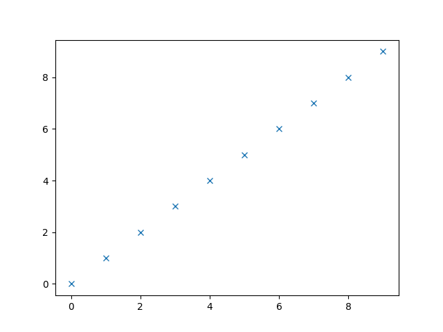
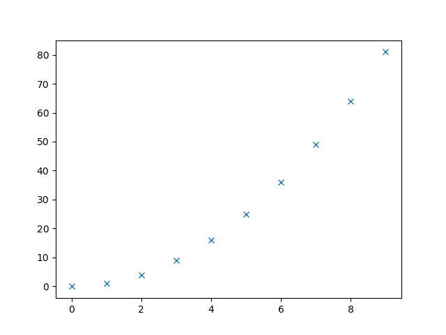
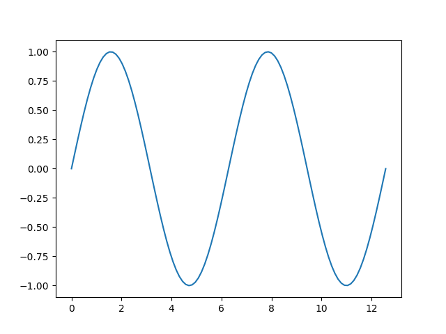
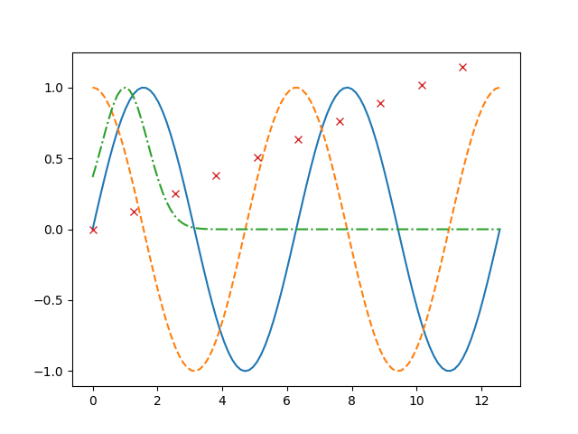

 -*- coding: utf-8 -*-


 ```python 
import matplotlib.pyplot as plt
import numpy as np
 ``` 
 This chapter is dedicated to `matplotlib`. Usage of `matplotlib` is generally
 beautiful and fun. Try to execute following code


 ```python 
fig, ax1 = plt.subplots()
ax1.plot(range(10), 'x')
plt.savefig('./formd/fig1.png')

 ``` 

 

 If usage was succesfull, try another one. If not, do not be upset and find
 someone who can help you


 ```python 
fig, ax2 = plt.subplots()
ax2.plot(np.arange(10)**2, 'x')
plt.savefig('./formd/fig2.png')

 ``` 

 

 Since I've reached my limit of useful information, I will quote my
 favourite parts from John Cheevers's short stories.
 ## The Wrysons

 Irene Wryson's oddness centered on a dream. She dreamed once or twice a month
 that someone - some enemy or  hapless American pilot - had exploded a
 hydrogen bomb. In the light of day, her dream was inadmissible, for she
 could not relate it to her garden, her interest in upzoning, or her
 comefortable way of life.  The dream cost her much in energy and composure,
 and often left her deeply depressed. Its sequence of events varied, but it
 usually went like this.


 ```python 
x = np.linspace(0, 4*np.pi, 100)
y = np.sin(x)
fig, ax3 = plt.subplots()
ax3.plot(x, y)
plt.savefig('./formd/fig3.png')

 ``` 

 

 The dream was set in Shady Hill - —she dreamed that she woke in her own bed.
 Donald was always gone. She was at once aware of the fact that the bomb had
 exploded. Mattress stuffing and a trickle of brown water were coming through
 a big hole in the ceiling. The sky was gray - —lightless - —although there
 were in the west a few threads of red light, like those charming vapor
 trails we see in the air after the sun has set. She didn’t know if these were
 vapor trails or some part of that force that would destroy the marrow in her
 bones. The gray air seemed final.


 ```python 
fig, ax4 = plt.subplots()
ax4.plot(x, np.sin(x), '-')
ax4.plot(x, np.cos(x), '--')
ax4.plot(x, np.exp(-(x-1)**2), '-.')
ax4.plot(x[::10], x[::10]/10, 'x')
plt.savefig('./formd/fig4.png')

 ``` 

 

 And how could she lean across the breakfast table and explain her pallor to
 her husky husband with this detailed vision of the end of the world? He
 would have laughed his jackass laugh.
